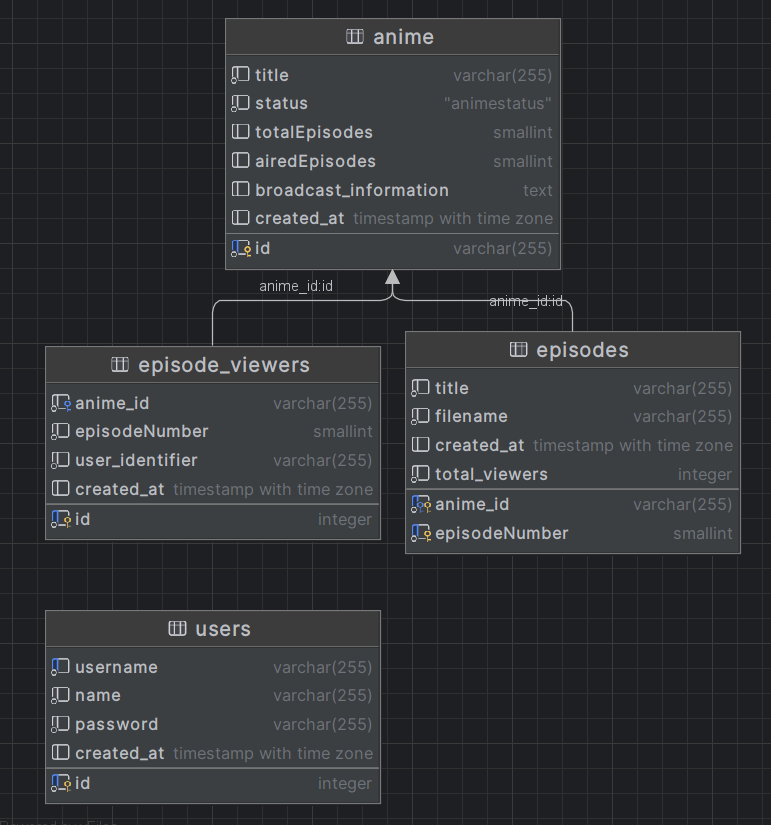

# ListWibuKu - Rest

ListWibuKu Rest is a site that provide anime streaming service.

## Contributors

1. Akbar Maulana Ridho, 13521093
2. Eugene Yap Jin Quan, 13521074

## Database Schema

## Endpoint Api

This service on default run on `http://localhost:3000`

## Endpoint Documentation

The majority of the API documentation is written in OpenAPI format inside [docs folder](docs/v1.json). However, there are two endpoint
that are not written there

### Endpoint GET `/anime/:id/episodes/:episode_number/stream`

Receive access token cookie or basic authentication. This will return mp4 video stream.

### Endpoint POST `/file`

Receive chunked file in binary data with additional chunkNumber and totalChunks value. After successful upload on latest
chunk, this will return uploaded filename.

## Requirement

1. Docker Installed

## Installation Guide

1. Clone repo
2. Inside the repository, run `docker compose up`
3. (Optional) run seeder on host computer with `npm run seed`

## How to Run API

Make sure the docker container are up and running. Open the website on http://localhost:3000

## Bonus Feature

- Caching. Used to cache anime, episode, and subscriber user (cache response from soap service). This is implemented
  with node-cache.

## Contributions

| Tugas                                 | NIM      |
| ------------------------------------- | -------- |
| Authentication (login, register, etc) | 13521074 |
| Anime CRUD                            | 13521074 |
| Anime episodes CRUD                   | 13521093 |
| Episode streaming and viewer counter  | 13521093 |
